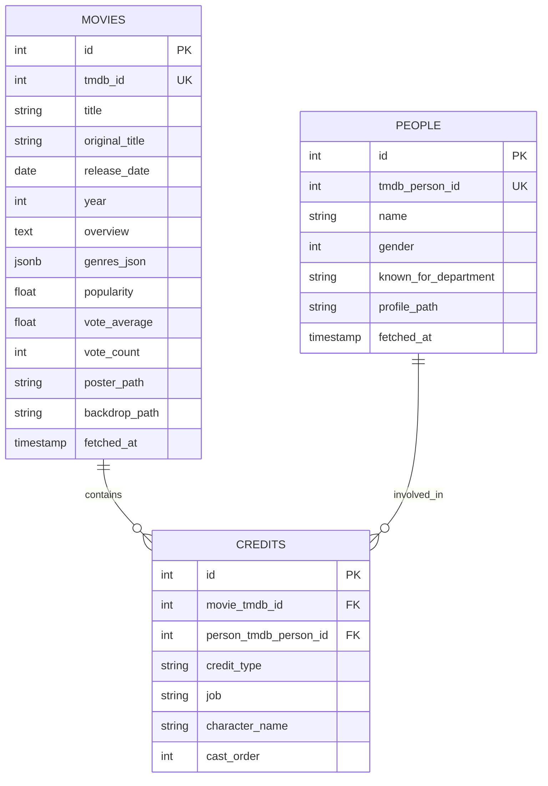

# PenineMate

> AI-powered movie assistant for asking about films and getting personalized movie recommendations based on mood, genre, theme, and duration.

[](#)
[](#)
[](#)
[](#)

---

## 📌 Overview

PenineMate is a movie discovery and Q&A website built for people who want to explore films faster and more naturally. Users can ask questions like “Who directed this movie?”, “What is the plot of Inception?”, or “Recommend me a tense thriller under 120 minutes,” and the system responds using a combination of PostgreSQL data, FAISS semantic search, TMDb API enrichment, and OpenAI-powered answer generation.

This project combines a modern frontend experience with a backend AI pipeline to deliver a conversational movie assistant and recommendation engine in one platform.

---

## ✨ Features

- Smart movie Q&A chat with natural-language questions
- Recommendation engine based on genre, mood, theme, storyline, year, and duration
- Hybrid search flow using FAISS + PostgreSQL + TMDb fallback
- Movie detail retrieval with cast and director information
- Daily global chat limit protection on the QA endpoint
- API health, stats, and LLM status monitoring
- Dockerized setup for local development and deployment

---

## 🏗️ Architecture

```text
┌──────────────────────┐      ┌────────────────────────────┐      ┌──────────────────────┐
│ Frontend (Next.js)   │────▶ │ FastAPI Backend            │────▶ │ PostgreSQL + FAISS   │
│ React + TypeScript    │      │ Movie QA + Recommendation  │      │ Movie metadata + index│
└──────────────────────┘      └────────────────────────────┘      └──────────────────────┘
             │                               │                                 │
             │                               ▼                                 │
             │                     OpenAI + TMDb API Integration                 │
             └────────────────────────────────────────────────────────────────────┘
```

### Data flow

- The frontend sends user queries from the Home page, Ask Bot page, and Recommendation page.
- The backend API handles requests through FastAPI endpoints under `/api/v1`.
- Movie search uses a hybrid strategy: FAISS semantic vectors first, then PostgreSQL enrichment, then TMDb fallback if needed.
- Recommendation requests are processed by a rules-based service with TMDb discovery and local DB fallback.
- OpenAI is used for query classification and answer generation, while movie metadata comes from TMDb and the local PostgreSQL database.

---

## 🗃️ Core Database Schema



The core entities are:
- `movies` — main metadata for each movie
- `people` — cast and crew identities
- `credits` — relationship table connecting people to movies and their roles

---

## 🛠️ Tech Stack

### Frontend

| Technology | Purpose |
|---|---|
| Next.js 16 | Web application framework |
| React 19 | UI rendering |
| TypeScript | Type-safe frontend development |
| Tailwind CSS | Styling and layout |
| Framer Motion | UI animation |
| React Query | API state management |
| Axios | HTTP requests |

### Backend

| Technology | Purpose |
|---|---|
| FastAPI | REST API and request handling |
| Python | Backend logic |
| PostgreSQL | Movie metadata and relational data storage |
| FAISS | Semantic vector search |
| sentence-transformers | Embedding generation |
| OpenAI API | LLM classification and answer generation |
| TMDb API | Movie metadata and discovery enrichment |

### Infrastructure

| Technology | Purpose |
|---|---|
| Docker Compose | Local environment orchestration |
| PostgreSQL 15 | Main relational database |
| Dockerfile | Backend and frontend containerization |
| .env configuration | Secrets and runtime settings |

---

## 🧠 How the App Works

### 1. Ask Bot
Users can ask natural-language questions on the Ask Bot page. The backend:
- classifies the intent with OpenAI,
- searches relevant movies,
- retrieves contextual metadata from the database,
- generates a natural answer with the relevant film information.

### 2. Movie Search
The search endpoint uses a hybrid system:
- FAISS semantic vector matching,
- year-aware query enhancement,
- PostgreSQL result enrichment,
- TMDb fallback when data is not found locally.

### 3. Recommendation Engine
On the Recommendation page, users can enter filters such as:
- genres,
- mood,
- theme,
- storyline,
- year,
- duration.

The system tries TMDb discovery first, then falls back to local database matching and returns a recommended movie with the metadata needed by the UI.

---

##  Project Structure

```text
PenineMate/
├── backend/
│   ├── api/
│   │   ├── __init__.py
│   │   ├── main.py
│   │   ├── middleware.py
│   │   ├── models.py
│   │   └── routes.py
│   ├── peninemate/
│   │   ├── core_logic/
│   │   │   ├── db_ops.py
│   │   │   ├── faiss_builder.py
│   │   │   ├── faiss_ops.py
│   │   │   ├── qa_db.py
│   │   │   ├── qa_service.py
│   │   │   ├── recommendation_service.py
│   │   │   └── search_orchestrator.py
│   │   ├── infrastructure/
│   │   │   ├── cache_client.py
│   │   │   ├── db_client.py
│   │   │   ├── embedding_client.py
│   │   │   ├── llm_client.py
│   │   │   └── tmdb_client.py
│   │   └── settings_sql_database/
│   │       ├── schema.sql
│   │       └── migrations/
│   ├── dataset/
│   │   ├── enhanced_box_office_data(2000-2024).csv
│   │   └── movielens-20m-dataset/
│   ├── Dockerfile
│   ├── requirements.txt
│   └── run_api.py
├── frontend/
│   ├── src/
│   ├── public/
│   ├── package.json
│   ├── next.config.js
│   └── Dockerfile
├── docker-compose.yml
├── start-dev.ps1
├── README.md
└── peninemate_plain_dump.sql
```

---

## 🧪 Main API Endpoints

The backend provides a few core routes:

- `POST /api/v1/qa` — Ask a question about a movie
- `GET /api/v1/movies/search` — Search movies by title/keyword
- `GET /api/v1/movies/{tmdb_id}` — Get movie details and cast/director info
- `POST /api/v1/recommend` — Get a recommended movie based on filters
- `GET /api/v1/health` — Overall system health
- `GET /api/v1/stats` — Database, cache, and FAISS stats
- `GET /api/v1/llm/status` — OpenAI availability check
- `GET /api/v1/chat-limit` — Remaining global chat quota

---

## 🧭 How to Use

1. Open the website homepage.
2. Use the Ask Bot page to ask questions about any movie.
3. Search for a movie title or description to find relevant results.
4. Go to Recommendation to enter mood, genre, and duration preferences.
5. Review the recommended movie detail and explore the result.

---

## 🔐 Security and Operational Notes

- The API includes a daily global rate limit for chat requests.
- Sensitive configuration is expected to be stored in environment variables.
- TMDb and OpenAI credentials should never be committed directly to the repository.
- The project is designed to run in a Docker-based environment for consistent local deployment.

---

## 📌 Notes from Development

This project was built as a cinematic AI assistant combining movie metadata, semantic retrieval, and generative answer capabilities. The main goal is to provide a practical movie discovery experience where users can both learn about films and discover new titles based on personal preference.

> AI-powered movie discovery  
> Natural-language film Q&A  
> Personalized recommendations  

---

## 📝 License

This project is intended for portfolio and personal use. Please adjust the license or ownership terms before production deployment or public distribution.

---

*© 2026 PenineMate. Built for movie exploration and recommendation experiences.*
